+++
date = '2025-12-31T12:00:00+08:00'
draft = false
title = '皖南行'
description = '皖南游记'
summary = '年底有几天假，打算去皖南逛一逛。'
isCJKLanguage = true
categories = ['life']
tags = ['travel']
slug = 'travel-in-the-south-of-anhui'
+++

年底有几天假，打算去皖南逛一逛。问了父母要不要一起出去旅游，都没意愿，于是28号的下午我一个人背着包坐上了去潜山的高铁。

第一站是天柱山，而潜山高铁站离天柱山真够远的，打车有二十多公里。找了个景区南大门附近的民宿住了一晚，价格在当地来算并不便宜，空调制热效果一般，伙食也贵得很。唯一好处就是民宿位于海拔六百多米的山上，早上起早的话可以打开窗户直接看到山间的日出。在那静谧的群山中，夜的帷幕缓缓收起。起初，天边只泛起一抹柔和的橙晕，宛如少女羞涩的绯红脸颊。随着时间的推移，橙晕逐渐蔓延，将墨蓝色的天空染成了瑰丽的锦缎。须臾，一抹亮光透过朦胧的山雾，洒下一片斑驳的光影。

如果没看到日出，那民宿的价格是相当坑人的。其实本来的打算是在天柱山顶看日出，但由于冬天山路上冻，景区停止了夜游的项目。

吃过早饭后闲晃到景区南门口开始登山，具体时间是7:54。第一次爬这么高的山，经验和准备略有不足。首先是衣物，爬山很消耗体力，所以不应该穿这么厚实，即便现在是冬天，也应该穿透气性良好的内衣和防风的外套。其次是水，我只带了一瓶纯净水，本来打算是在山上买水，也做了山上商品价格更贵的心理准备，但看到那两倍的价格，还是只买了一瓶水。下次再爬山，还是提前准备水和食物更好。

爬山的艰辛不足为道，一路走走停停，尽情欣赏大自然的鬼斧神工。10:59登上天池峰的峰顶，历时三小时多一点点。天柱峰由于过于陡峭，景区并没有开发出旅游路线，因此只能在天池峰隔崖相望。远远望去，天柱峰在连绵起伏的群山中拔地而起，擎天而立，极其巍峨壮观。

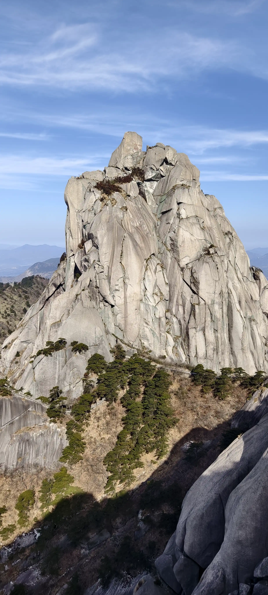

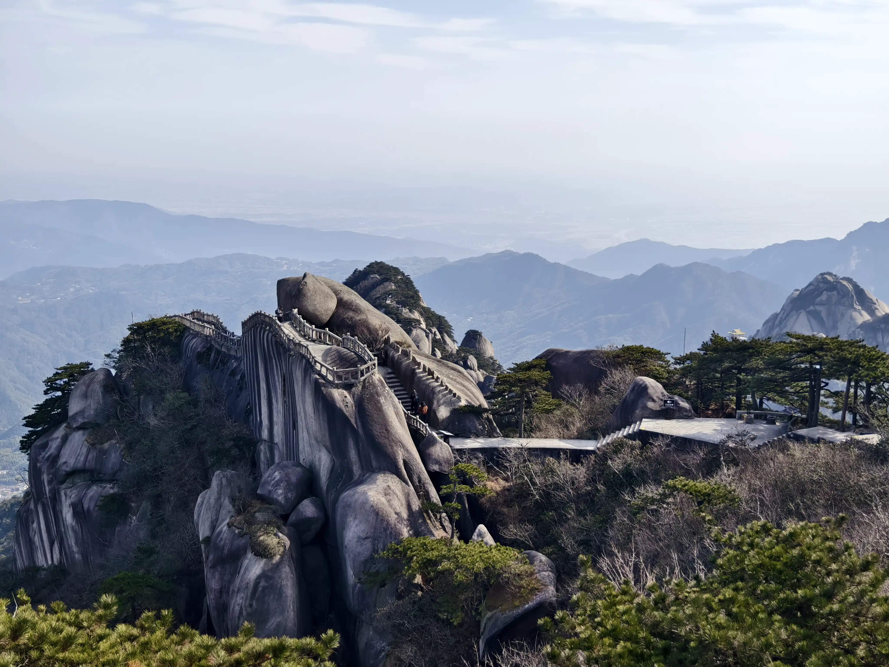

上山的路线走的几乎是最近的，而下山的路线绕了点远，而且在炼丹湖的岔路口走错了道，走向了迎真峰和飞虎峰，上上下下耽搁了时间，也消耗了更多的体力。迎真峰上去和下来的石阶都极为陡峭，扶手也很低矮，而边上就是悬崖峭壁，估计大风一吹没站稳的话就会掉下深渊。翻过飞虎峰的时候碰到一个不怕生人的狸花猫，我坐在路边歇息的时候，它径直走过来在我腿上趴着了。撸了好一会猫，手感软乎乎的。走到南门口的时候已经15:13，错过了15:27从潜山到黄山的高铁。当时即便从飞虎峰下来后通过牧羊河索道下山，时间其实也赶不上了，索性继续徒步。

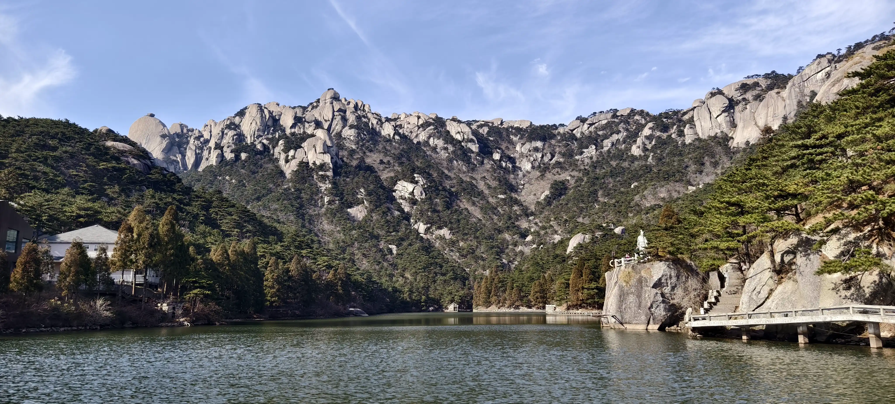

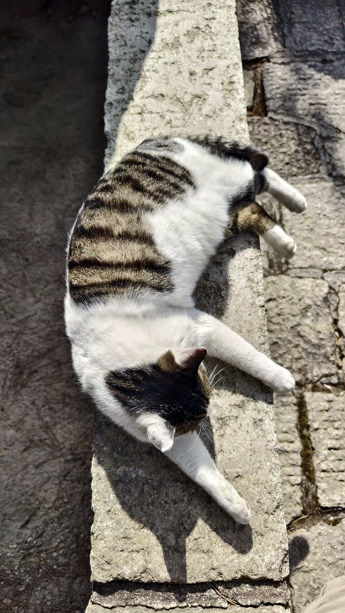

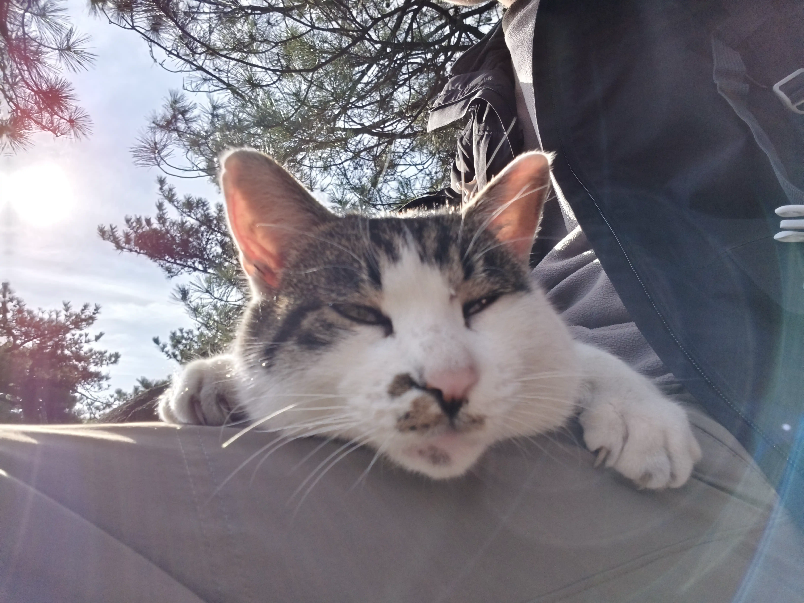

错过了也没什么大不了的，反正我还没买那班高铁票。挑了个17:21到安庆的班次，预订的是D座，分配的是B座，结果上车的时候有个D座的乘客要跟家人坐一块，想跟我对换座位，遂爽快答应。果真巧合。上车的时候天色尚且昏暗，17:44下车的时候，夜色已然降临。

中午因为爬山没吃午饭，一路只吃了几块阿尔卑斯糖和一块士力架，出安庆站的时候又饿又累，在附近随便吃了碗面，找了个酒店就躺床上不想动了。精神放松下来后，肌肉的酸痛开始上涌。早知道应该找一个带浴缸的酒店，舒适地泡个澡，而不是淋浴，站着都嫌疼。

连锁酒店的空调就是给力，六点多就给嗓子干醒了。起床倒水的时候感觉小腿肌肉依旧酸痛，步子迈大点都难。从安庆到黄山的车票定在12:56，上午便躺在酒店的床上看《额尔古纳河右岸》。

14:00到达黄山北站，出站后还要搭乘一小时左右的景区班车到景区南门的换乘中心。是不是这些有高山的风景区离高铁站都挺远的？想想也应如此，不然欣赏自然风光的时候看到高铁呼啸而过，还挺煞风景的。而且城区大多也建在平原，山岭地带发展城市的成本未免过于高昂。

腿脚还是略有不便，直接网上搜带有浴缸的住宿。搜到个比较便宜的民宿，但是离换乘中心有一公里多。腿脚没问题的话一公里也不是问题，但现在只好慢悠悠的晃着腿荡过去，愣是走了三十多分钟。

31号早上7点多出民宿，民宿老板送了地图和登山杖。在民宿对面的饭店简单吃了顿早饭，店老板把我和另外几个顾客一起送到了景区班车的换乘中心。景区班车19元，需要半小时的路程。大巴司机载着一车人，在弯弯绕绕的两车道山路上一阵狂飙，多次跟对向大巴在弯道会车，速度也没怎么减，再一看窗外的悬崖峭壁，索性闭眼装睡。

因为腿脚还没恢复，所以直接买了云谷索道缆车票，上行单程65元。山里云雾极多，坐在缆车里看周围白茫茫一片。出缆车后，对面的山头云雾缭绕，若隐若现。往前走过一段栈道，栈道边的树上有数只猴子，不少游客在此喂猴拍照。小腿肌肉还是紧绷的，每走一步都疼，因此走得既艰辛又缓慢，只参观了石笋矼、始信峰、猴子观海、丹霞峰、飞来石、光明顶等，从光明顶下来后就16点左右了，拖着老残腿赶往索道。听景区工作人员说索道在16:40就关闭了，我在线上是没法预订了，但是16:55赶到索道的时候，还是能买到的。问了售票员到底几点停运索道，售票员只说了随时。下山处有家蜜雪冰城，蜜雪冰城的价格倒没怎么变，买了杯8元的红豆奶茶，瞬间暖和多了。

考虑到第二天就是元旦了，估计各个景区的人都会增多，还是回家修养一下吧。景区班车票加上到高铁站的大巴票总共49元，路程用时约90分钟。晚上十点左右到家，历时三天多的皖南行正式结束。

单说爬山难度的话，我认为天柱山比黄山更难。因为天柱山不像黄山那样有很多景色，可以走走停停，可能走两步就能看到很好看的风景值得拍照留念；天柱山的风景几乎都在峰顶，需要人沿着石阶一直往上走。都说上山容易下山难，天柱山的峰顶离下山点也有点距离，不管是坐索道还是徒步。本来上山只是大腿肌肉酸，下一趟山后整个腿都觉得不是自己的了。

站在山顶，望着远处的风景，感慨自然的辽阔，城市里的那些烦恼也变得可笑。一步步走，总能到山顶，因为山顶就在那；但是生活的大山呢？不知道什么时候是个头。一步步走吧，没有比人更高的山，没有比脚更长的路。

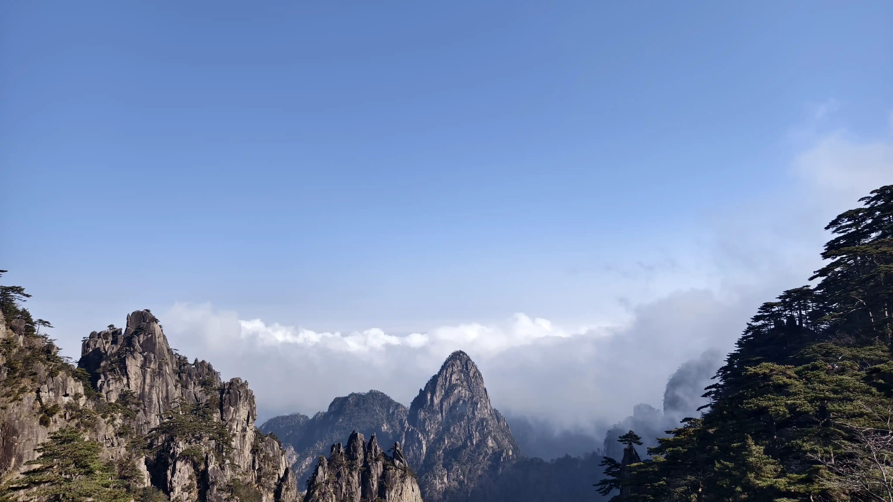

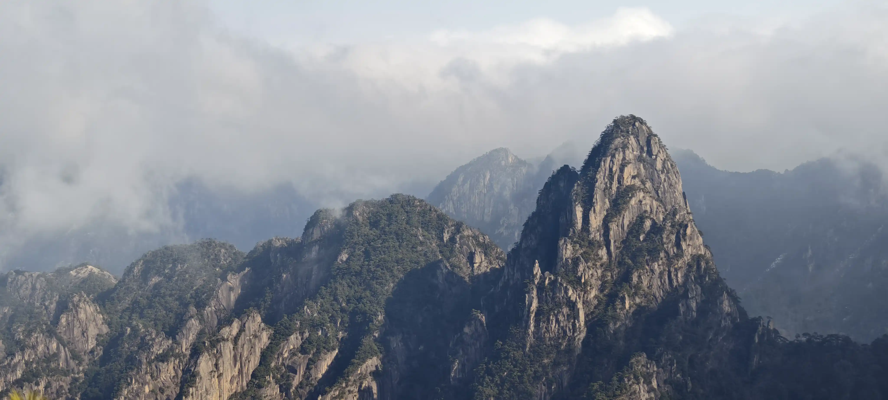

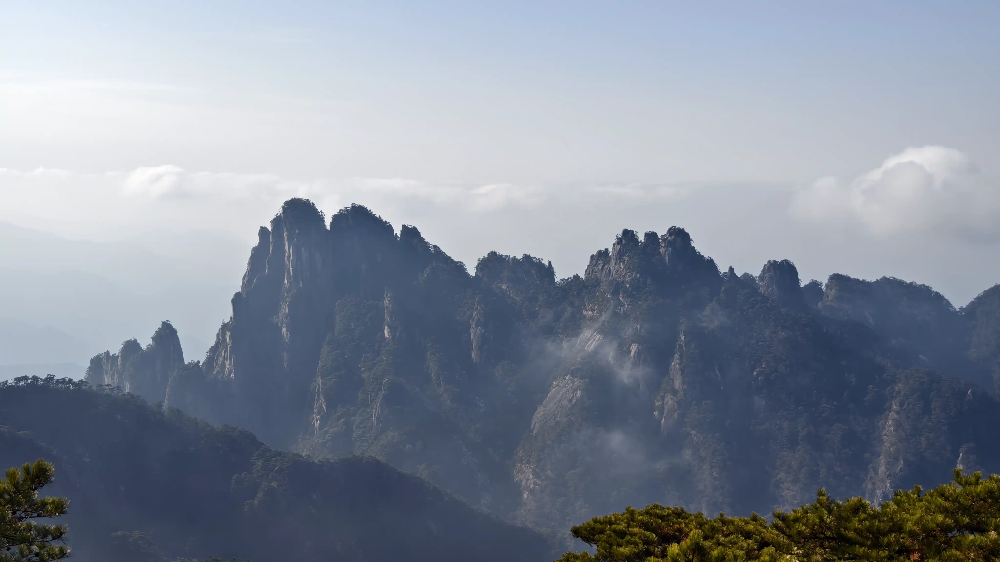

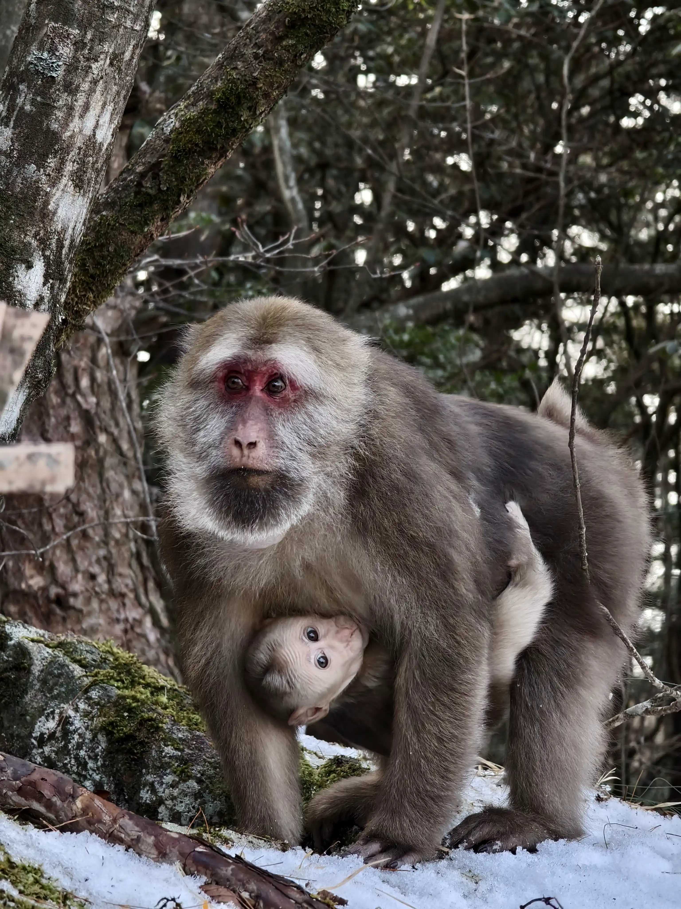

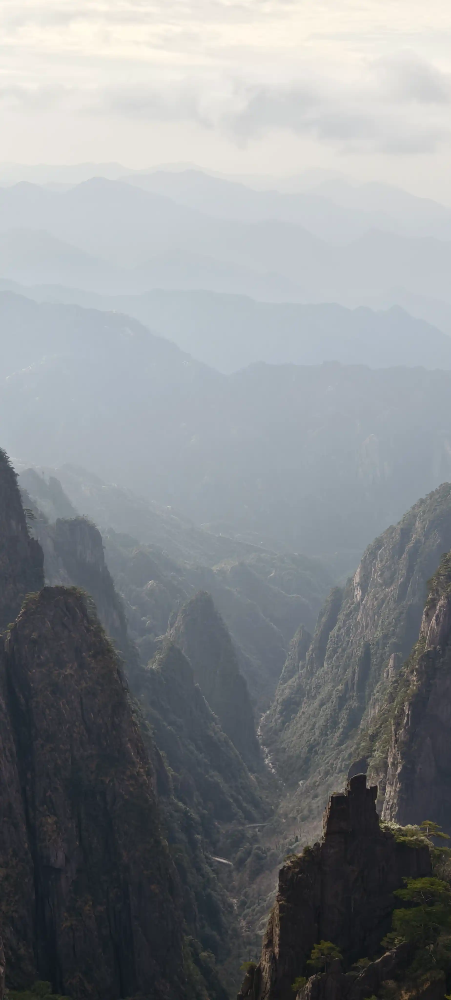

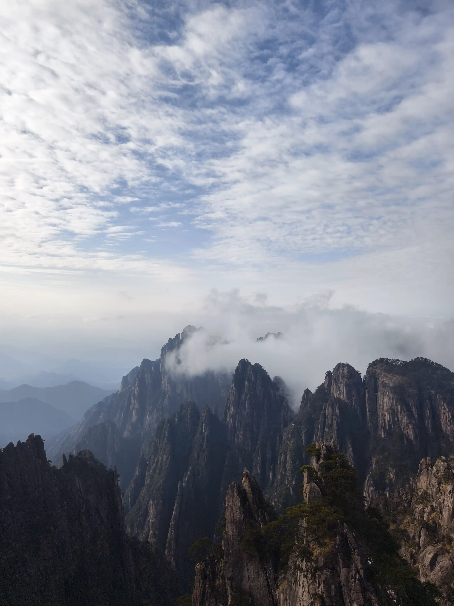

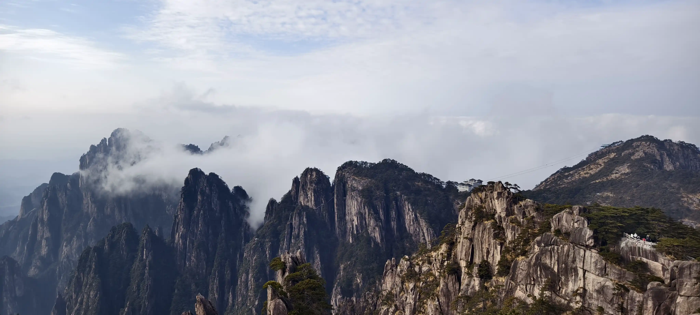

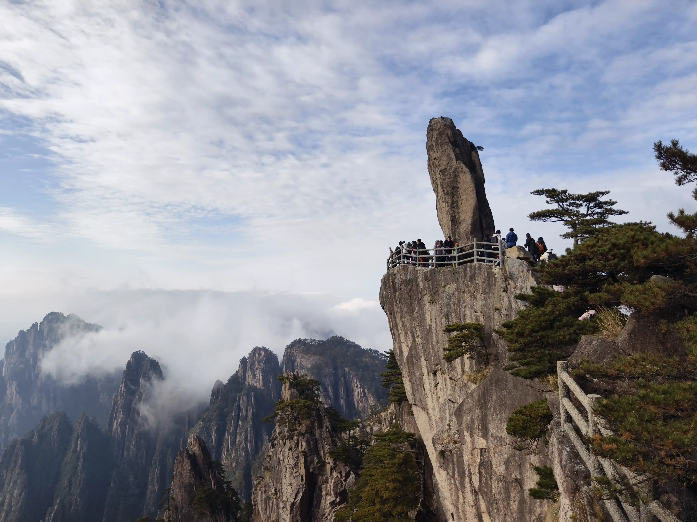

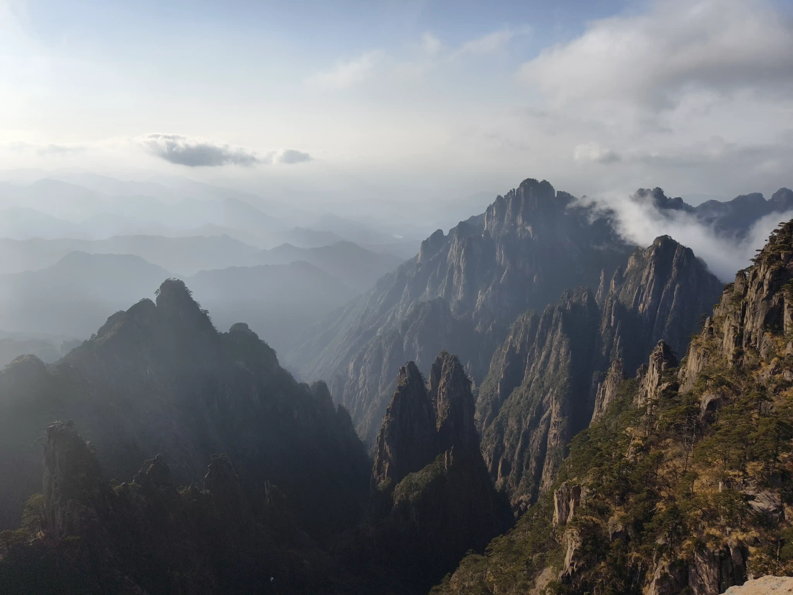