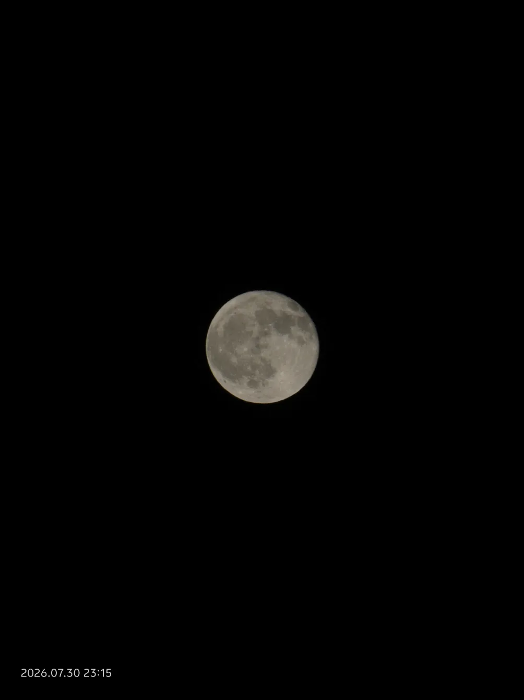
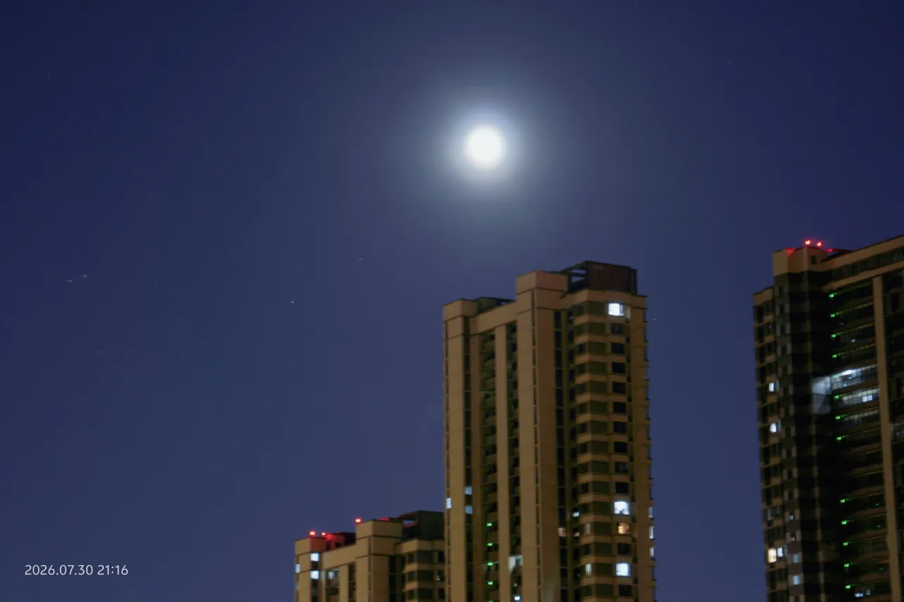
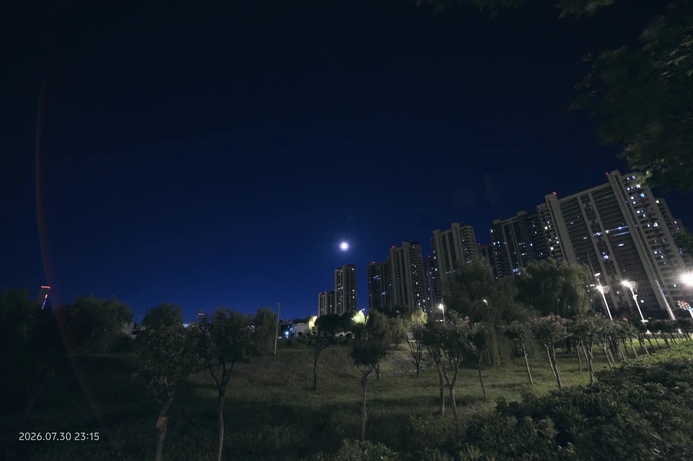

+++
date = '2026-07-30T22:34:48+08:00'
lastmod = '2026-07-30T22:34:48+08:00'
draft = false
isCJKLanguage = true
title = '夏夜十七的月亮'
description = '某天夏夜农历十七的月亮'
summary = '某天夏夜农历十七的月亮'
categories = ["life"]
tags = ["life", "photo"]
keywords = ["life", "photo"]
slug = 'moon-in-a-summer-night'
+++

买的《DK植物大百科》送到了，晚饭后空气还残留着不少白天的暑气，所以我等到20点多才踱步去快递站取件。

刚出单元门，向东门走去，抬头看见一轮皎洁的月亮，像一盏谁挂在楼角的灯笼，将月光温柔地洒在地上。取件的时候刷了下手机，看到朋友圈正好也有人在分享这片月色，于是我就到周边找空旷地，准备也拍一拍月亮。

小区北边有条小河，我第一时间想到这个位置。走到这里的时候，晚风已经变得非常凉快，还带有点温润的水汽。镜头拉到最长焦距，感光度调到100，先试试直接拍月亮。

*PS: 水印时间有误，实际应该是21点左右*

晚风还是挺大的，长焦镜头不太好稳住，拍了十几张，只有上面这张勉强算对上焦，还算清晰。

稍微收了点焦距，想拍一张月亮挂在楼顶的照片，但不管怎么拍都把月亮拍过曝了。回去再琢磨怎么解决过曝的问题吧，这水边的蚊子够多的，按快门的那几秒，胳膊上都能爬上好几只蚊子，而且我没穿袜子，穿着凉鞋就出来了，再多待一会我就全喂蚊子了。

最后再来个广角，收工赶紧走人。

---

回去洗澡的时候发现脚上被咬得到处都是红包，躺床上痒得直抠脚。。。