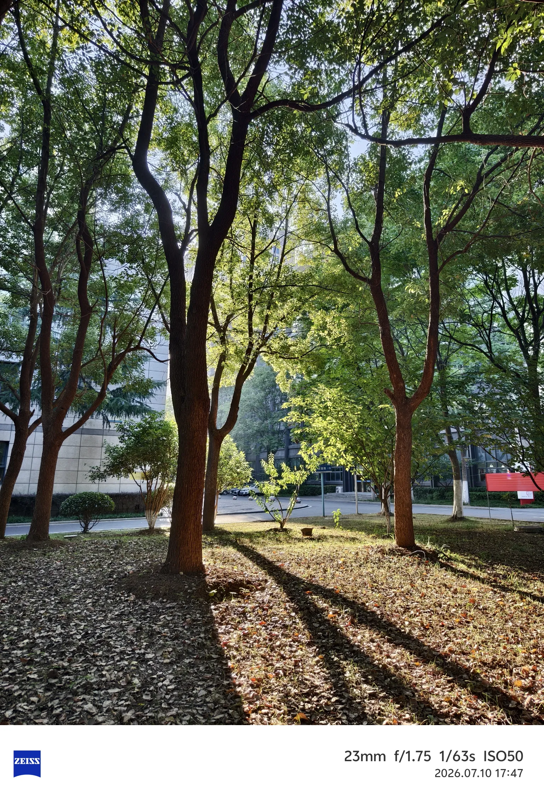
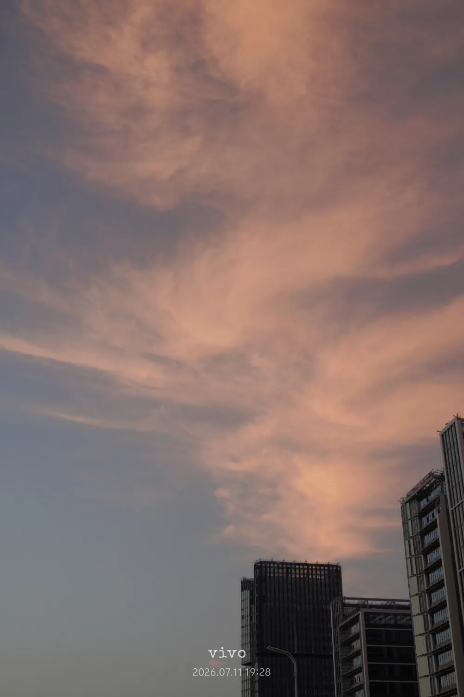
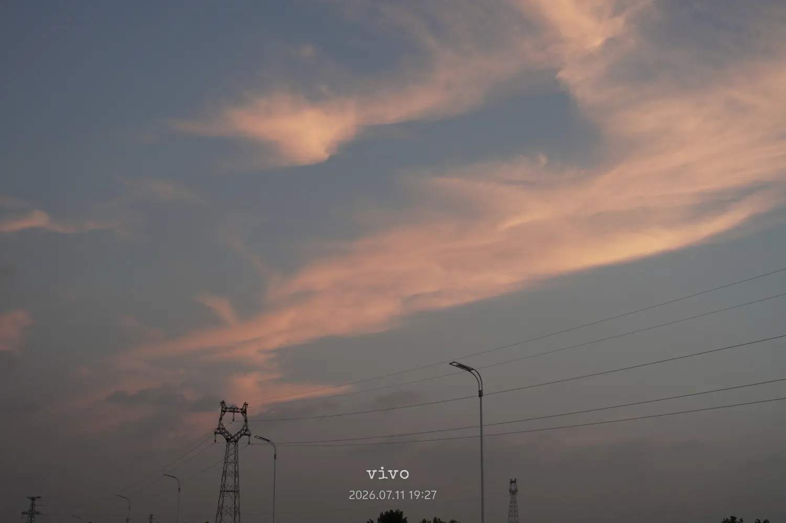
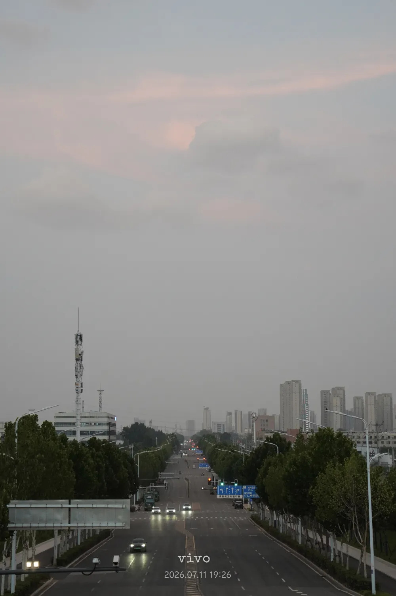
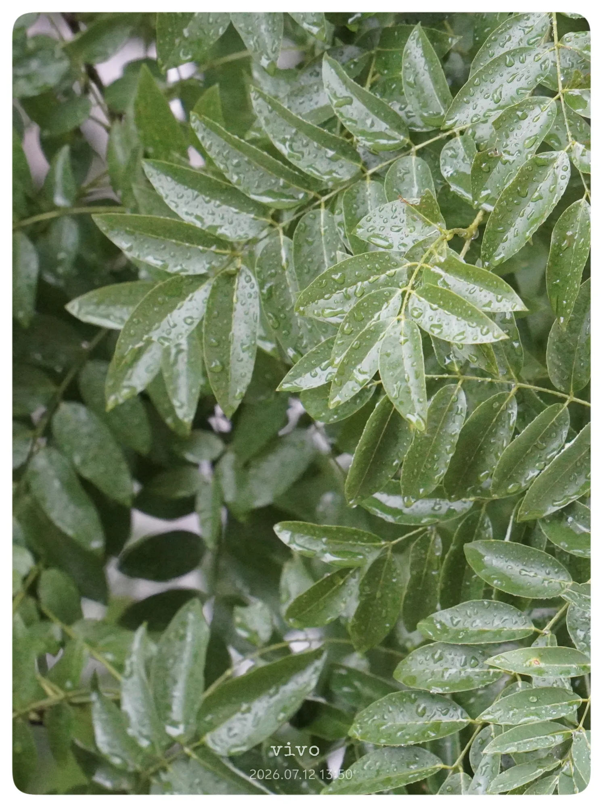
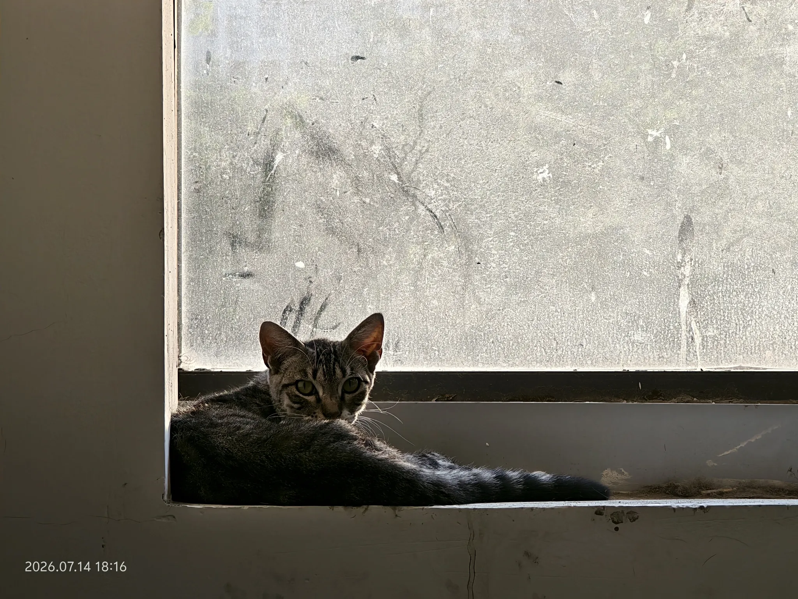
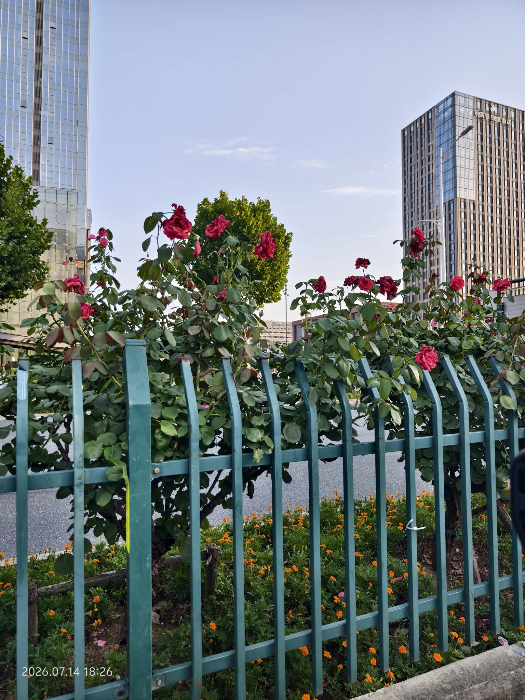
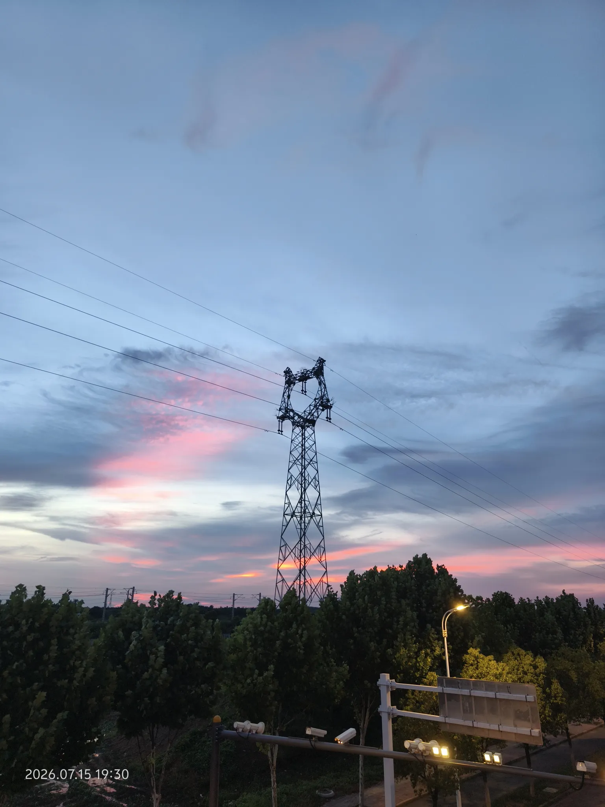

+++
date = '2026-07-15T00:10:26+08:00'
lastmod = '2026-07-15T00:10:26+08:00'
draft = false
isCJKLanguage = false
title = 'Life Lately — A Photo Journal'
description = 'A photo journal of everyday life from late June to mid-July: lotus at Shufengwan Park, evening walks, a typhoon rainy day, a team movie outing, and a stray kitten'
summary = 'A photo journal of everyday life from late June to mid-July: lotus at Shufengwan Park, evening walks, a typhoon rainy day, a team movie outing, and a stray kitten'
categories = ["life"]
tags = ["life", "photo", "AI-Translated"]
keywords = ["life", "photo"]
slug = 'recent-days-20260715'
+++

On the weekend of June 28, I had a sudden urge to go see the lotus flowers. So I braved the blazing summer sun and biked 10 kilometers to Shufengwan Park. On the way, I passed a vacant lot full of blooming zinnias.

Back in the summer of 2022, I used to visit Shufengwan Park often. Its waters are home to both lotus flowers and water lilies. This time I arrived early in the season — only a handful of lotus blossoms had opened, and the water lilies were still fast asleep.

I ran into an elderly gentleman who was also there to admire the lotus, walking his Teddy dog. The poor pup — it was way too hot for such a furry coat, and it hadn't even been trimmed.

---

On July 10, I was walking through the campus path after work and glanced westward — the light was just beautiful.

---

July 11, Saturday. After dinner I went out for a stroll. There's a road near home that's been closed for a while. Seeing no traffic on the bridge, I decided to walk up.

⬇️ At the time, it felt like the clouds were billowing out of the building. The dark, shadowy building in the photo looks almost like a chimney.

⬇️ I don't know why, but high-voltage towers against the dusk sky always give me a lonely, melancholic feeling.

⬇️ Does this look like a profile of a person? The cloud at the top forms the head, the thicker part is the eye area, and the protruding part below is the nose and mouth. The lower right corner looks like an arm raised inward.

⬇️ Standing on the bridge looking down at the road below. Not a bad shot — at least it's straight.

⬇️ A plane swept overhead. Even at maximum zoom, this was the best I could capture — and remarkably, it didn't come out blurry at all, handheld at that focal length.

---

⬇️ July 12 — Typhoon Bavi passed through, and it rained all day. This is the locust tree downstairs (well, I *think* it's a locust tree — the flowers look like acacia blossoms). I gave the photo a simple edit and added a white frame. It reminded me of a magazine cover I'd seen before.

⬇️ For the first time, I earned the Rare Diamond achievement in Duolingo's weekly league.

---

⬇️ July 13 — team building event. After lunch, we went to see a movie: *Kung Fu Football*. I made it through the first ten-some minutes, then just closed my eyes and pretended to nap. Made it through the 106-minute runtime somehow. Not really my kind of film.

---

⬇️ July 14 — on my way to work in the morning, I spotted a little cat on the stairwell landing. But as soon as I got close, it darted away. To my surprise, I ran into it again in the same spot after work. After seeing so many chubby, well-fed cats online, this one looked so thin and small. I ordered some squeeze-up cat treats when I got home — I'd been meaning to for a while, but kept forgetting. Next time I meet a stray, I'll see if the treats work their magic. 🐱

⬇️ On the way home from work — roses blooming in the median strip.

---

⬇️ July 15 — on my evening walk, I passed the high-voltage towers once more. It wasn't that late yet, and pink clouds sprawled freely across the horizon.

---

*PS: All images have been compressed to optimize page loading.*
