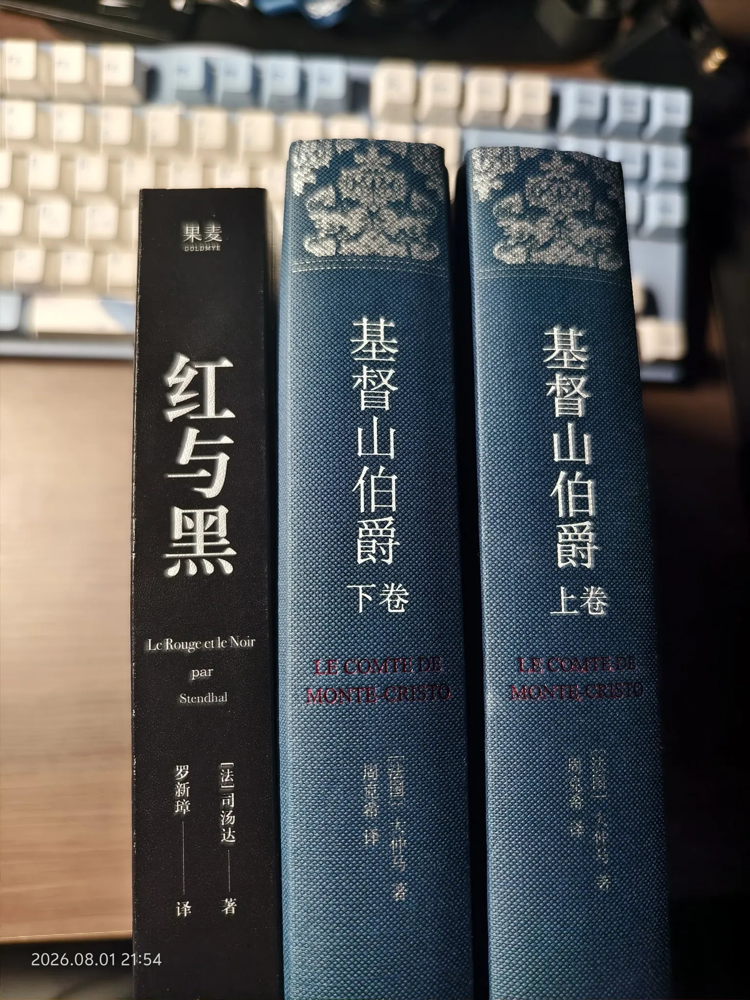

+++
date = '2026-08-01T23:28:09+08:00'
lastmod = '2026-08-01T23:28:09+08:00'
draft = false
isCJKLanguage = true
title = '读《红与黑》和《基督山伯爵》'
description = '近日刚读完的《红与黑》和《基督山伯爵》'
summary = '近日刚读完《红与黑》和《基督山伯爵》'
categories = ['life']
tags = ['read']
keywords = ["红与黑", "基督山伯爵"]
slug = 'read-two-books-20260801'
+++

7月17号的时候看完了司汤达的《红与黑》，今天又看完了大仲马的《基督山伯爵》，下一本打算看雨果的《悲惨世界》。年初订立阅读计划的时候，倒没注意到三本书的社会环境都是法国。

先说《红与黑》。我看的是罗新璋的译本，翻译有点文绉绉的，不是很习惯，断断续续看了好久。自己看得时候没觉得这本书写的有多好，只觉得于连这人缺点不少。后来看了别人的解析才发现自己漏了太多，这里贴上我认为很不错的分析：[鞭临天下的回答 - 知乎](https://www.zhihu.com/question/20347582/answer/1980975983998809593)

读《红与黑》的时候对于连意气用事尚不理解，后来读到《基督山伯爵》后才知道法国当时的社会风气可能就是这样。

《基督山伯爵》的剧情看起来就很“爽文”，周克希的译本翻译得也很流畅。读到下半部的时候正好周六，花了一天时间直接读完了。