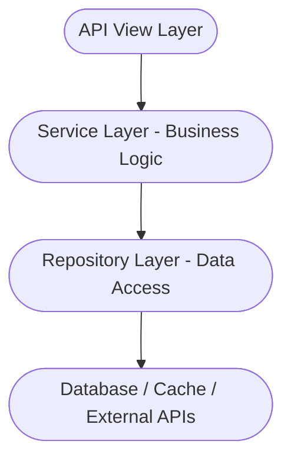

+++
date = '2026-08-09T15:44:25+08:00'
lastmod = '2026-08-09T15:44:25+08:00'
draft = false
isCJKLanguage = false
title = 'Applying the Repository Pattern in FastAPI'
description = 'Separate data access from business logic with the Repository pattern in FastAPI'
summary = 'Separate data access from business logic with the Repository pattern in FastAPI'
categories = ["program"]
tags = ["python", "fastapi", "AI-Translated"]
keywords = ["python", "fastapi"]
[params]
  hasMermaid = true
slug = 'repository-pattern-in-fastapi'
+++

## Introduction

In flexible web frameworks like FastAPI or Flask, there are many ways to structure the code path from API to database — minimal approaches for small projects, more elaborate arrangements for larger ones. If you only have two or three endpoints with simple business logic, it's perfectly fine to call the database directly from the view functions. For bigger projects, a common approach is to split the code into three layers: the view layer that defines the API, the data access layer (often named "dao" or "services"), and the underlying database. Choose a layering structure that fits your project's size — there's no need to wrap simple business logic in layers for the sake of complexity. Avoid over-engineering.

For my part, I use the Repository data access pattern in every project except the most trivial ones. The Repository pattern gives you four layers:



Combined with FastAPI's built-in dependency injection — which provides a database session per request — this handles the database connection lifecycle cleanly, and unit tests don't need to connect to a real database.

## What Is the Repository Pattern

The Repository pattern is a **data access abstraction**: it hides the details of *how* data is stored and retrieved (SQL, ORM calls, caching, remote APIs, etc.) behind a set of interfaces oriented around domain concepts, so the upper layer (the Service layer) only needs to think "I want a user" — not "does this user come from a database table, Redis, or a third-party API".

- **View layer.** Receives and validates parameters, calls the service, and returns the result.
- **Service layer.** Business logic and transaction boundaries.
- **Repository layer.** Data access. The Repo layer never touches transactions — transactions belong to the Service layer, so multiple Repo methods can share a single transaction. For example, a read-then-update flow can run inside one transaction and commit once at the end, guaranteeing data consistency. When working with a relational database, the Repo layer just operates within the current transaction and never commits on its own.
- **Data layer.** Databases, caches, external APIs, etc.

### Advantages

1. **Decoupled business and data access**: The Service layer doesn't depend on a specific database/ORM, so the intent of the code is clearer ("register a user" vs "INSERT INTO users...").
2. **Centralized query logic**: Pagination, sorting, filtering, and other data access details live in one place instead of being scattered around.
3. **Easier testing**: You can mock the Repository when testing the Service layer without a database, and test the Repository itself against a temporary database.
4. **Cheap to switch data sources**: Switching from SQLite to PostgreSQL, or even adding a Redis cache layer, only requires swapping the Repo implementation — the upper layers stay untouched.
5. **A unified data access boundary**: Permission filtering ("users can only see their own data") can be implemented once in the Repo layer, so it can't be missed.

### Disadvantages

1. **Boilerplate code**: Every entity needs its own Repo, and most CRUD methods look alike.
2. **Layer overhead**: In simple CRUD projects, "route → Service → Repo → ORM" is a lot of indirection and may be over-engineering.
3. **Transaction semantics can get confusing**: If there's no clear discipline about which layer owns transactions and who commits, it's easier to introduce bugs than writing ORM calls directly.
4. **Complex queries can get awkward**: Multi-table JOINs and aggregation queries feel out of place in a Repo; sometimes you need an extra "query service" or CQRS.

## Example Code

The following example shows how to build a simple user registration and login service with the Repository pattern. The code layout is shown below. `pkg.config` and `pkg.log` are simple configuration and logging modules, so their implementations are omitted. `__init__.py` files exist mainly for convenient imports and are also omitted unless they add extra functionality.

```shell
.
├── data  # SQLite data file directory
├── internal
│   ├── apis
│   │   ├── group_v1.py
│   │   ├── __init__.py
│   │   └── user_route.py
│   ├── database
│   │   ├── app_sqlite.py
│   │   └── __init__.py
│   ├── models
│   │   ├── base.py
│   │   ├── __init__.py
│   │   └── user_model.py
│   ├── repository
│   │   ├── __init__.py
│   │   └── user_repo.py
│   └── services
│       ├── __init__.py
│       └── user_service.py
├── main.py
├── pkg
│   ├── config
│   │   ├── config.py
│   │   └── __init__.py
│   └── log
│       ├── __init__.py
│       └── log.py
├── pyproject.toml
├── README.md
├── tests
│   ├── conftest.py
│   ├── test_api.py
│   ├── test_user_repo.py
│   └── test_user_service.py
└── uv.lock
```

### 1. Configure the SQLite Connection

- File: `internal/database/app_sqlite.py`

```python
from typing import AsyncGenerator

from sqlalchemy import event
from sqlalchemy.ext.asyncio import AsyncSession, async_sessionmaker, create_async_engine

from pkg.config import cfg

# The data directory must exist in advance; create_async_engine won't create it
db_engine = create_async_engine(
    f"sqlite+aiosqlite:///data/{cfg.service_sqlite_path}",
    echo=False,
    connect_args={
        "check_same_thread": False,
        "timeout": 15,
    },
)


# Enable WAL mode for SQLite on every new connection
@event.listens_for(db_engine.sync_engine, "connect")  # Requires the sync engine
def set_sqlite_pragma(dbapi_conn, connection_record):
    cursor = dbapi_conn.cursor()
    cursor.execute("PRAGMA journal_mode=WAL")
    cursor.execute("PRAGMA synchronous=NORMAL")  # Balance performance and safety
    cursor.execute(
        "PRAGMA wal_autocheckpoint=1000"
    )  # Auto-checkpoint every 1000 pages to keep the WAL file small
    cursor.execute("PRAGMA busy_timeout=5000")  # Wait up to 5 seconds when busy
    cursor.close()


# Async session factory
async_session = async_sessionmaker(
    db_engine,
    expire_on_commit=False,  # Recommended for async: keeps objects usable after commit
    class_=AsyncSession,
    autoflush=False,
    autocommit=False,
)


async def get_db_session() -> AsyncGenerator[AsyncSession, None]:
    """FastAPI dependency that manages the session lifecycle."""
    async with async_session() as session:
        try:
            yield session
        except Exception as e:
            await session.rollback()
            raise e
```

- File: `internal/database/__init__.py`. Provides table creation and connection cleanup.

```python
from internal.models import Base

from .app_sqlite import db_engine, get_db_session


class DatabaseManager:
    @staticmethod
    async def create_tables() -> None:
        async with db_engine.begin() as conn:
            await conn.run_sync(Base.metadata.create_all)

    @staticmethod
    async def close_engine() -> None:
        if db_engine:
            await db_engine.dispose()


__all__ = [
    "get_db_session",
    "DatabaseManager",
]
```

### 2. Data Models

Declarative base class: `internal/models/base.py`

```python
from sqlalchemy.orm import DeclarativeBase


class Base(DeclarativeBase):
    """Declarative base class that all ORM models must inherit."""

    pass
```

User model: `internal/models/user_model.py`

```python
from datetime import datetime, timezone

from sqlalchemy import Boolean, DateTime, String
from sqlalchemy.orm import Mapped, mapped_column

from .base import Base


def _utc_now() -> datetime:
    """Return the current UTC time.

    Passed as a callable to default/onupdate so it isn't evaluated once
    at class definition time, which would give every row the same timestamp.
    """
    return datetime.now(timezone.utc)


class User(Base):
    __tablename__ = "users"

    # SQLAlchemy 2.0 style: type annotations define the mapping
    # Mapped[str] defaults to NOT NULL; Mapped[str | None] is nullable
    id: Mapped[int] = mapped_column(primary_key=True)
    username: Mapped[str] = mapped_column(String(50), unique=True)
    email: Mapped[str] = mapped_column(String(100), unique=True)
    full_name: Mapped[str | None] = mapped_column(String(100))
    password: Mapped[str] = mapped_column(String(100))
    is_active: Mapped[bool] = mapped_column(Boolean, default=True)
    created_at: Mapped[datetime] = mapped_column(
        DateTime(timezone=True), default=_utc_now, nullable=False
    )
    updated_at: Mapped[datetime] = mapped_column(
        DateTime(timezone=True), default=_utc_now, onupdate=_utc_now, nullable=False
    )

    def __repr__(self):
        # Note: never include sensitive fields like password, to avoid leaks in logs/debugging
        return (
            f"<User(id={self.id}, username='{self.username}', email='{self.email}', "
            f"full_name='{self.full_name}', is_active={self.is_active}, "
            f"created_at='{self.created_at}', updated_at='{self.updated_at}')>"
        )

```

### 3. Data Access Layer: UserRepository

- `internal/repository/user_repo.py`

```python
from sqlalchemy import select
from sqlalchemy.ext.asyncio import AsyncSession

from internal.models import User


class UserRepo:
    """Data access layer for the users table.

    Responsibilities:
    - Only handles data access (queries/inserts); does not manage sessions or transactions.
    - Sessions are created by the FastAPI dependency ``get_db_session``,
      and transaction boundaries are controlled by the service layer.
    - This layer never raises business exceptions; database errors such as
      unique-constraint violations (e.g. ``IntegrityError``) propagate as-is.
    """

    def __init__(self, session: AsyncSession):
        self.model = User
        self.session = session

    async def get_by_id(self, id: int) -> User | None:
        """Query a user by primary key."""
        stmt = select(self.model).where(self.model.id == id)
        result = await self.session.execute(stmt)
        return result.scalar_one_or_none()

    async def get_by_username(self, username: str) -> User | None:
        """Query a user by username (unique)."""
        stmt = select(self.model).where(self.model.username == username)
        result = await self.session.execute(stmt)
        return result.scalar_one_or_none()

    async def get_by_email(self, email: str) -> User | None:
        """Query a user by email (unique)."""
        stmt = select(self.model).where(self.model.email == email)
        result = await self.session.execute(stmt)
        return result.scalar_one_or_none()

    async def create(
        self,
        username: str,
        email: str,
        full_name: str,
        password: str,
        is_active: bool = True,
    ) -> User:
        """Create a user.

        Note: this only does ``add + flush`` to trigger the INSERT and does **not commit**.
        Committing/rolling back is controlled by the service layer so that multiple
        operations can share a single transaction; unique-constraint violations
        (duplicate username/email) raise ``IntegrityError`` at flush time.
        """
        user = User(
            username=username,
            email=email,
            full_name=full_name,
            password=password,
            is_active=is_active,
        )
        self.session.add(user)
        await self.session.flush()
        return user

    async def get_active_users(self, limit: int = 100, offset: int = 0) -> list[User]:
        """Query active users with pagination (ordered by id for stable pagination)."""
        stmt = (
            select(self.model)
            .where(self.model.is_active.is_(True))
            .order_by(self.model.id)
            .limit(limit)
            .offset(offset)
        )
        result = await self.session.execute(stmt)
        return list(result.scalars().all())

```

### 4. Business Logic Layer: UserService

- `internal/services/user_service.py`

```python
from sqlalchemy.exc import IntegrityError
from sqlalchemy.ext.asyncio import AsyncSession

from internal.models import User
from internal.repository import UserRepo


class UserService:
    """Business logic layer.

    Transaction boundary: this layer opens/commits/rolls back transactions.
    ``async with self.session.begin()`` rolls back automatically on exceptions
    and commits on normal exit.
    """

    def __init__(self, session: AsyncSession):
        self.session = session
        self.user_repo = UserRepo(session)

    async def login(self, username: str, password: str) -> tuple[bool, str]:
        """Authenticate a user (passwords are compared in plain text here; hashing is required in production)."""
        user = await self.user_repo.get_by_username(username)
        if user is None:
            return False, "User not found"
        if not user.is_active:
            return False, "User is inactive"
        if user.password != password:
            return False, "Incorrect password"
        # Assume the user is valid and generate a JWT token
        return True, "mock_jwt_token"

    async def register(
        self, username: str, email: str, full_name: str, password: str
    ) -> tuple[bool, str]:
        """Register a new user.

        - Check username / email for duplicates first to return more specific errors;
        - then insert; in concurrent scenarios there is a race window between
          "check" and "insert", covered by the database unique constraints +
          ``IntegrityError``;
        - the whole flow runs in a single transaction, so any failure rolls back automatically.
        """
        try:
            async with self.session.begin():
                if await self.user_repo.get_by_username(username):
                    return False, "Username already exists"
                if await self.user_repo.get_by_email(email):
                    return False, "Email already exists"
                await self.user_repo.create(username, email, full_name, password)
                return True, "User registered successfully"
        except IntegrityError:
            # Concurrent registration: a race window exists between the duplicate
            # check and the insert; the unique constraint catches it here,
            # and the transaction has already been rolled back automatically
            return False, "Username or email already exists"

    async def get_user_by_id(self, id: int) -> User | None:
        """Query a user by primary key."""
        return await self.user_repo.get_by_id(id)

    async def get_user_by_username(self, username: str) -> User | None:
        """Query a user by username."""
        return await self.user_repo.get_by_username(username)

    async def get_user_by_email(self, email: str) -> User | None:
        """Query a user by email."""
        return await self.user_repo.get_by_email(email)

```

### 5. View Layer

- `internal/apis/user_route.py`. Session via dependency injection.

```python
from http import HTTPStatus

from fastapi import APIRouter, Depends
from pydantic import BaseModel
from sqlalchemy.ext.asyncio import AsyncSession

from internal.database import get_db_session
from internal.services import UserService

router = APIRouter(prefix="/users", tags=["Users"])


class RegisterUserRequest(BaseModel):
    username: str
    email: str
    password: str
    full_name: str


class LoginUserRequest(BaseModel):
    username: str
    password: str


@router.post("/register")
async def register_user(
    request: RegisterUserRequest, session: AsyncSession = Depends(get_db_session)
):
    user_service = UserService(session=session)
    status, message = await user_service.register(
        username=request.username,
        email=request.email,
        full_name=request.full_name,
        password=request.password,
    )
    if not status:
        return {
            "code": HTTPStatus.BAD_REQUEST.value,
            "message": message,
        }
    return {
        "code": HTTPStatus.CREATED.value,
        "message": message,
    }


@router.post("/login")
async def login_user(
    request: LoginUserRequest, session: AsyncSession = Depends(get_db_session)
):
    user_service = UserService(session=session)
    status, token = await user_service.login(
        username=request.username,
        password=request.password,
    )
    if not status:
        return {
            "code": HTTPStatus.BAD_REQUEST.value,
            "message": "login failed",
        }
    return {
        "code": HTTPStatus.OK.value,
        "message": "login success",
        "data": {
            "token": token,
        },
    }

```

- v1 route group, mounting the user API routes. `internal/apis/group_v1.py`

```python
from fastapi import APIRouter

from .user_route import router as user_router


def create_api_group() -> APIRouter:
    router = APIRouter(prefix="/api/v1", tags=["v1"])

    router.include_router(user_router)

    return router

```

- App factory: `internal/apis/__init__.py`. Uses lifespan for table creation and database connection management.

```python
from contextlib import asynccontextmanager

from fastapi import FastAPI

from internal.database import DatabaseManager

from .group_v1 import create_api_group


@asynccontextmanager
async def lifespan(app: FastAPI):
    try:
        await DatabaseManager.create_tables()
        yield
    finally:
        await DatabaseManager.close_engine()


def create_app() -> FastAPI:
    app = FastAPI(lifespan=lifespan)
    api_group = create_api_group()
    app.include_router(api_group)
    return app


__all__ = [
    "create_app",
]

```

### 6. Main Entry Point

- `main.py`

```python
import uvicorn

from internal.apis import create_app

app = create_app()

if __name__ == "__main__":
    uvicorn.run(app, host="127.0.0.1", port=10001, workers=1)

```

## Unit Tests

Testing with pytest:

```shell
uv add --dev pytest pytest-asyncio
uv run pytest -v
```

### conftest

`conftest.py` is a special configuration file in pytest for sharing test data, parameters, and helpers. It doesn't need to be imported explicitly — pytest discovers and loads it automatically. `conftest.py` is typically used with the `@pytest.fixture` decorator to provide flexible setup and teardown.

A temporary SQLite engine is created under pytest's temp directory for each test function, so tests never pollute each other.

- `tests/conftest.py`

```python
"""Global pytest fixtures: an isolated temporary SQLite database per test."""

from pathlib import Path

import pytest_asyncio
from httpx import ASGITransport, AsyncClient
from sqlalchemy import event
from sqlalchemy.ext.asyncio import async_sessionmaker, create_async_engine

from internal.apis import create_app
from internal.database import get_db_session
from internal.models import Base


@pytest_asyncio.fixture
async def db_engine(tmp_path: Path):
    """Create an isolated temporary SQLite engine per test, with PRAGMAs applied."""
    db_path = tmp_path / "test.sqlite"
    engine = create_async_engine(
        f"sqlite+aiosqlite:///{db_path}",
        connect_args={"check_same_thread": False, "timeout": 15},
    )

    @event.listens_for(engine.sync_engine, "connect")
    def set_sqlite_pragma(dbapi_conn, connection_record):
        cursor = dbapi_conn.cursor()
        cursor.execute("PRAGMA journal_mode=WAL")
        cursor.execute("PRAGMA synchronous=NORMAL")
        cursor.execute("PRAGMA busy_timeout=5000")
        cursor.close()

    async with engine.begin() as conn:
        await conn.run_sync(Base.metadata.create_all)
    yield engine
    await engine.dispose()


@pytest_asyncio.fixture
async def session_factory(db_engine):
    """Return an async session factory bound to the temporary database."""
    return async_sessionmaker(
        db_engine,
        expire_on_commit=False,
        autoflush=False,
        autocommit=False,
    )


@pytest_asyncio.fixture
async def session(session_factory):
    """Provide an isolated session for repo/service layer tests."""
    async with session_factory() as sess:
        yield sess


@pytest_asyncio.fixture
async def client(session_factory):
    """Provide a FastAPI test client backed by the temporary database.

    Uses ASGITransport + dependency_overrides to replace get_db_session,
    so the lifespan never runs and the real data/ database is never touched.
    """
    app = create_app()

    async def override_get_db_session():
        async with session_factory() as sess:
            yield sess

    app.dependency_overrides[get_db_session] = override_get_db_session

    async with AsyncClient(
        transport=ASGITransport(app=app), base_url="http://test"
    ) as c:
        yield c

```

### test_api

- `tests/test_api.py`

```python
"""API-layer integration tests (full route stack + temporary database)."""

REGISTER_PAYLOAD = {
    "username": "alice",
    "email": "alice@example.com",
    "full_name": "Alice",
    "password": "secret",
}


async def test_register_success(client):
    resp = await client.post("/api/v1/users/register", json=REGISTER_PAYLOAD)
    assert resp.status_code == 200
    body = resp.json()
    assert body["code"] == 201
    assert body["message"] == "User registered successfully"


async def test_register_duplicate(client):
    await client.post("/api/v1/users/register", json=REGISTER_PAYLOAD)
    resp = await client.post("/api/v1/users/register", json=REGISTER_PAYLOAD)
    assert resp.status_code == 200
    assert resp.json()["code"] == 400


async def test_login_success(client):
    await client.post("/api/v1/users/register", json=REGISTER_PAYLOAD)
    resp = await client.post(
        "/api/v1/users/login",
        json={"username": "alice", "password": "secret"},
    )
    assert resp.status_code == 200
    body = resp.json()
    assert body["code"] == 200
    assert body["data"]["token"] == "mock_jwt_token"


async def test_login_failed(client):
    resp = await client.post(
        "/api/v1/users/login",
        json={"username": "nobody", "password": "secret"},
    )
    assert resp.status_code == 200
    assert resp.json()["code"] == 400

```

### test_service

- `tests/test_user_service.py`

```python
"""UserService business logic tests (including transaction boundary verification)."""

from internal.repository import UserRepo
from internal.services import UserService


async def _register(service, **kwargs):
    defaults = dict(
        username="alice",
        email="alice@example.com",
        full_name="Alice",
        password="secret",
    )
    defaults.update(kwargs)
    return await service.register(**defaults)


async def test_register_success(session):
    service = UserService(session)
    ok, message = await _register(service)
    assert ok is True
    assert message == "User registered successfully"
    # Transaction committed, so the new user is queryable
    assert (await UserRepo(session).get_by_username("alice")) is not None


async def test_register_duplicate_username(session):
    service = UserService(session)
    await _register(service, username="alice")
    ok, message = await _register(service, username="alice", email="other@example.com")
    assert ok is False
    assert message == "Username already exists"


async def test_register_duplicate_email(session):
    service = UserService(session)
    await _register(service, email="alice@example.com")
    ok, message = await _register(service, username="bob", email="alice@example.com")
    assert ok is False
    assert message == "Email already exists"


async def test_register_integrity_error_fallback(session, monkeypatch):
    """Simulate a concurrent race: the duplicate check "misses" an existing user,
    and the unique constraint catches it at insert time."""
    repo = UserRepo(session)
    await repo.create(
        username="alice",
        email="alice@example.com",
        full_name="Alice",
        password="x",
    )
    await session.commit()

    service = UserService(session)

    async def fake_get_by_username(username):
        return None  # Simulate concurrency: another transaction hasn't committed yet

    monkeypatch.setattr(service.user_repo, "get_by_username", fake_get_by_username)

    ok, message = await _register(service, username="alice", email="new@example.com")
    assert ok is False
    assert message == "Username or email already exists"
    # Transaction rolled back automatically, session still usable
    assert (await UserRepo(session).get_by_username("alice")) is not None


async def test_login_success(session):
    service = UserService(session)
    await _register(service)
    ok, token = await service.login("alice", "secret")
    assert ok is True
    assert token == "mock_jwt_token"


async def test_login_wrong_password(session):
    service = UserService(session)
    await _register(service)
    ok, _ = await service.login("alice", "wrong")
    assert ok is False


async def test_login_user_not_found(session):
    service = UserService(session)
    ok, _ = await service.login("nobody", "secret")
    assert ok is False


async def test_login_inactive_user(session):
    repo = UserRepo(session)
    await repo.create(
        username="alice",
        email="alice@example.com",
        full_name="Alice",
        password="secret",
        is_active=False,
    )
    await session.commit()

    service = UserService(session)
    ok, _ = await service.login("alice", "secret")
    assert ok is False

```

### test_repo

- `tests/test_user_repo.py`

```python
"""UserRepo data access layer tests."""

import pytest
from sqlalchemy.exc import IntegrityError

from internal.repository import UserRepo


async def _create_user(repo, **kwargs):
    defaults = dict(
        username="alice",
        email="alice@example.com",
        full_name="Alice",
        password="secret",
    )
    defaults.update(kwargs)
    return await repo.create(**defaults)


async def test_get_by_id_hit(session):
    repo = UserRepo(session)
    user = await _create_user(repo)
    await session.commit()

    found = await repo.get_by_id(user.id)
    assert found is not None
    assert found.username == "alice"


async def test_get_by_id_miss(session):
    repo = UserRepo(session)
    assert await repo.get_by_id(9999) is None


async def test_get_by_username(session):
    repo = UserRepo(session)
    await _create_user(repo, username="bob")
    await session.commit()

    assert (await repo.get_by_username("bob")) is not None
    assert (await repo.get_by_username("nobody")) is None


async def test_get_by_email(session):
    repo = UserRepo(session)
    await _create_user(repo, email="carol@example.com")
    await session.commit()

    assert (await repo.get_by_email("carol@example.com")) is not None
    assert (await repo.get_by_email("missing@example.com")) is None


async def test_create_defaults(session):
    repo = UserRepo(session)
    user = await _create_user(repo)
    await session.commit()

    assert user.id is not None
    assert user.is_active is True
    assert user.created_at is not None
    assert user.updated_at is not None


async def test_create_duplicate_username_raises_integrity_error(session):
    repo = UserRepo(session)
    await _create_user(repo, username="eve")
    await session.commit()

    with pytest.raises(IntegrityError):
        await _create_user(repo, username="eve", email="other@example.com")


async def test_get_active_users_sorted_and_paginated(session):
    repo = UserRepo(session)
    for i in range(5):
        await _create_user(repo, username=f"user{i}", email=f"user{i}@example.com")
    await _create_user(
        repo, username="inactive", email="inactive@example.com", is_active=False
    )
    await session.commit()

    page = await repo.get_active_users(limit=2, offset=1)
    assert [u.username for u in page] == ["user1", "user2"]

    all_active = await repo.get_active_users()
    assert len(all_active) == 5

```
