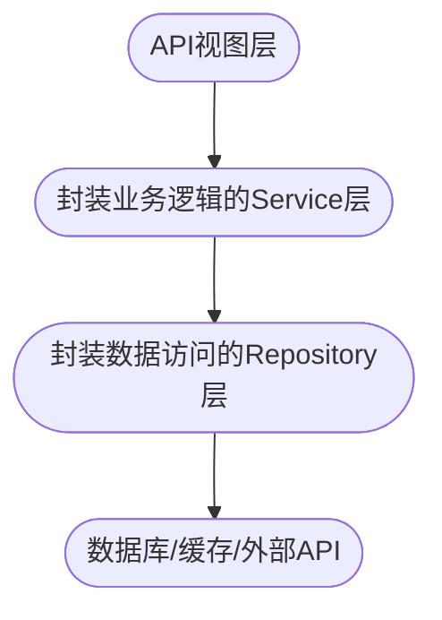

+++
date = '2026-08-09T15:44:25+08:00'
lastmod = '2026-08-09T15:44:25+08:00'
draft = false
isCJKLanguage = true
title = 'Repository 模式在 FastAPI 中的应用'
description = '在 FastAPI 中使用 Repository 模式，分离数据访问和业务逻辑'
summary = '在 FastAPI 中使用 Repository 模式，分离数据访问和业务逻辑'
categories = ["program"]
tags = ["python", "fastapi"]
keywords = ["python", "fastapi"]
[params]
  hasMermaid = true
slug = 'repository-pattern-in-fastapi'
+++

## 前言

在使用 FastAPI 或 Flask 这样框架灵活的 Web 项目中，从 API 到数据库，有很多种写法，小项目有小项目的极简写法，大项目有大项目的排兵布阵。如果就两三个接口，业务逻辑也很简单，大可以在视图函数中直接调用数据库连接执行操作。大点的项目为了代码更清晰，有的会分成三层：定义接口的视图层 -> 数据访问层，常见模块命名为"dao"或"services"等 -> 数据存储层，也就是数据库。根据项目规模大小，选择合适的代码分层结构，没必要为了复杂而把简单业务层层封装，要避免过度设计。

而对我来说，除了业务极简单的项目，我一般使用 Repository 数据访问模式。Repository 模式中会有四层：



再搭配 FastAPI 内置的依赖注入，为每个请求分配一个数据库 session，可以很好地处理数据库连接的生命周期问题，单元测试的时候也不需要连接真实的数据库。

## Repository 模式简介

Repository（仓库）模式是一种**数据访问抽象**：它把"如何存取数据"的细节（SQL、ORM 调用、缓存、远程 API 等）封装在一组面向领域概念的接口后面，让上层（Service 层）只关心"我想要一个用户"，而不关心"这个用户是从数据库表、Redis 还是第三方 API 拿到的"。

- 视图层。只做接收参数、参数校验、调用 service 并返回结果。
- Service 层。业务逻辑、事务边界。
- Repository 层。数据访问。Repo 层不碰事务，事务归 Service，这样多个 Repo 方法可以共享同一个事务。例如一个先查后改的逻辑，可以放在一个事务中，最后统一 commit，保证数据一致性。对于访问关系型数据库，只管用当前事务干活，绝不自己 commit。
- 数据层。数据库、缓存、外部 API 等。

### 优点

1. **业务与数据访问解耦**：Service 不依赖具体数据库/ORM，代码意图更清晰（"注册用户" vs "INSERT INTO users..."）。
2. **集中管理查询逻辑**：分页、排序、过滤等所有数据访问细节收敛到一处，避免散落在各处。
3. **便于测试**：测试 Service 时可以 mock Repository，不必连数据库；测试 Repository 时用临时库。
4. **切换数据源成本低**：把 SQLite 换成 PostgreSQL、甚至加一层 Redis 缓存，只需替换 Repo 实现，上层不动。
5. **统一数据访问边界**：比如权限过滤（"只能查自己的数据"）可以在 Repo 层统一实现，不会漏。

### 缺点

1. **样板代码**：每个实体都要写一套 Repo，增删改查大多雷同。
2. **间接层开销**：简单 CRUD 项目里，"路由 → Service → Repo → ORM" 四层有些绕，可能过度设计。
3. **事务语义容易混乱**：事务在哪个层、由谁 commit，如果没有明确纪律，比直接写 ORM 更容易出 bug。
4. **复杂查询容易混乱**：多表 JOIN、聚合报表这类查询放在 Repo 里会很别扭，有时需要额外引入"查询服务"或 CQRS。

## 示例代码

下面演示如何用 Repository 模式实现一个简单的用户登录注册的服务。代码结构如下，其中`pkg.config`和`pkg.log`模块就是简单的配置模块和日志模块，下面就不贴上具体代码了。`__init__.py` 主要是为了方便其它模块导入，除非有额外功能，否则下面也不贴上具体代码。

```shell
.
├── data  # sqlite 数据文件目录
├── internal
│   ├── apis
│   │   ├── group_v1.py
│   │   ├── __init__.py
│   │   └── user_route.py
│   ├── database
│   │   ├── app_sqlite.py
│   │   └── __init__.py
│   ├── models
│   │   ├── base.py
│   │   ├── __init__.py
│   │   └── user_model.py
│   ├── repository
│   │   ├── __init__.py
│   │   └── user_repo.py
│   └── services
│       ├── __init__.py
│       └── user_service.py
├── main.py
├── pkg
│   ├── config
│   │   ├── config.py
│   │   └── __init__.py
│   └── log
│       ├── __init__.py
│       └── log.py
├── pyproject.toml
├── README.md
├── tests
│   ├── conftest.py
│   ├── test_api.py
│   ├── test_user_repo.py
│   └── test_user_service.py
└── uv.lock
```

### 1. 配置 SQLite 数据连接

- 代码文件：`internal/database/app_sqlite.py`

```python
from typing import AsyncGenerator

from sqlalchemy import event
from sqlalchemy.ext.asyncio import AsyncSession, async_sessionmaker, create_async_engine

from pkg.config import cfg

# data 目录要提前建好，create_async_engine 不会自动建 data 目录
db_engine = create_async_engine(
    f"sqlite+aiosqlite:///data/{cfg.service_sqlite_path}",
    echo=False,
    connect_args={
        "check_same_thread": False,
        "timeout": 15,
    },
)


# 每次连接时为sqlite启用WAL模式
@event.listens_for(db_engine.sync_engine, "connect")  # 需要使用同步引擎
def set_sqlite_pragma(dbapi_conn, connection_record):
    cursor = dbapi_conn.cursor()
    cursor.execute("PRAGMA journal_mode=WAL")
    cursor.execute("PRAGMA synchronous=NORMAL")  # 平衡性能与安全性
    cursor.execute(
        "PRAGMA wal_autocheckpoint=1000"
    )  # 每 1000 页自动 checkpoint, 避免 wal 文件过大
    cursor.execute("PRAGMA busy_timeout=5000")  # 忙等待 5 秒
    cursor.close()


# 异步会话工厂
async_session = async_sessionmaker(
    db_engine,
    expire_on_commit=False,  # 异步场景建议关闭, 避免提交后对象失效
    class_=AsyncSession,
    autoflush=False,
    autocommit=False,
)


async def get_db_session() -> AsyncGenerator[AsyncSession, None]:
    """用于FastAPI依赖注入, 自动管理会话生命周期"""
    async with async_session() as session:
        try:
            yield session
        except Exception as e:
            await session.rollback()
            raise e
```

- 代码文件：`internal/database/__init__.py`。提供建表和关闭连接的方法。

```python
from internal.models import Base

from .app_sqlite import db_engine, get_db_session


class DatabaseManager:
    @staticmethod
    async def create_tables() -> None:
        async with db_engine.begin() as conn:
            await conn.run_sync(Base.metadata.create_all)

    @staticmethod
    async def close_engine() -> None:
        if db_engine:
            await db_engine.dispose()


__all__ = [
    "get_db_session",
    "DatabaseManager",
]
```

### 2. 数据模型类

声明基类： `internal/models/base.py`

```python
from sqlalchemy.orm import DeclarativeBase


class Base(DeclarativeBase):
    """所有 ORM 模型都必须继承的声明式基类。"""

    pass
```

用户数据类：`internal/models/user_model.py`

```python
from datetime import datetime, timezone

from sqlalchemy import Boolean, DateTime, String
from sqlalchemy.orm import Mapped, mapped_column

from .base import Base


def _utc_now() -> datetime:
    """返回当前 UTC 时间。

    作为 callable 传入 default/onupdate，避免在类定义时立刻求值一次、
    导致所有行的默认时间戳完全相同。
    """
    return datetime.now(timezone.utc)


class User(Base):
    __tablename__ = "users"

    # SQLAlchemy 2.0 新式声明：类型注解即映射信息
    # Mapped[str] 默认 NOT NULL，Mapped[str | None] 默认可空
    id: Mapped[int] = mapped_column(primary_key=True)
    username: Mapped[str] = mapped_column(String(50), unique=True)
    email: Mapped[str] = mapped_column(String(100), unique=True)
    full_name: Mapped[str | None] = mapped_column(String(100))
    password: Mapped[str] = mapped_column(String(100))
    is_active: Mapped[bool] = mapped_column(Boolean, default=True)
    created_at: Mapped[datetime] = mapped_column(
        DateTime(timezone=True), default=_utc_now, nullable=False
    )
    updated_at: Mapped[datetime] = mapped_column(
        DateTime(timezone=True), default=_utc_now, onupdate=_utc_now, nullable=False
    )

    def __repr__(self):
        # 注意：不要包含 password 等敏感字段，避免日志/调试时泄露
        return (
            f"<User(id={self.id}, username='{self.username}', email='{self.email}', "
            f"full_name='{self.full_name}', is_active={self.is_active}, "
            f"created_at='{self.created_at}', updated_at='{self.updated_at}')>"
        )

```

### 3. 数据访问层: UserRepository

- `internal/repository/user_repo.py`

```python
from sqlalchemy import select
from sqlalchemy.ext.asyncio import AsyncSession

from internal.models import User


class UserRepo:
    """用户表数据访问层。

    职责边界：
    - 只负责数据访问（查询/插入），不管理会话与事务。
    - 会话由 FastAPI 依赖 ``get_db_session`` 创建，事务边界由 service 层控制。
    - 本层不抛业务异常；唯一约束等数据库错误原样上抛（如 ``IntegrityError``）。
    """

    def __init__(self, session: AsyncSession):
        self.model = User
        self.session = session

    async def get_by_id(self, id: int) -> User | None:
        """按主键查询用户。"""
        stmt = select(self.model).where(self.model.id == id)
        result = await self.session.execute(stmt)
        return result.scalar_one_or_none()

    async def get_by_username(self, username: str) -> User | None:
        """按用户名查询用户（用户名唯一）。"""
        stmt = select(self.model).where(self.model.username == username)
        result = await self.session.execute(stmt)
        return result.scalar_one_or_none()

    async def get_by_email(self, email: str) -> User | None:
        """按邮箱查询用户（邮箱唯一）。"""
        stmt = select(self.model).where(self.model.email == email)
        result = await self.session.execute(stmt)
        return result.scalar_one_or_none()

    async def create(
        self,
        username: str,
        email: str,
        full_name: str,
        password: str,
        is_active: bool = True,
    ) -> User:
        """创建用户。

        注意：这里只 ``add + flush`` 触发 INSERT，**不 commit**。
        提交/回滚由 service 层统一控制，这样多个操作可以共享同一事务；
        唯一约束冲突（重复 username/email）会在 flush 时抛出 ``IntegrityError``。
        """
        user = User(
            username=username,
            email=email,
            full_name=full_name,
            password=password,
            is_active=is_active,
        )
        self.session.add(user)
        await self.session.flush()
        return user

    async def get_active_users(self, limit: int = 100, offset: int = 0) -> list[User]:
        """分页查询所有激活用户（按 id 升序，保证分页顺序稳定）。"""
        stmt = (
            select(self.model)
            .where(self.model.is_active.is_(True))
            .order_by(self.model.id)
            .limit(limit)
            .offset(offset)
        )
        result = await self.session.execute(stmt)
        return list(result.scalars().all())

```

### 4. 业务逻辑层: UserService

- `internal/services/user_service.py`

```python
from sqlalchemy.exc import IntegrityError
from sqlalchemy.ext.asyncio import AsyncSession

from internal.models import User
from internal.repository import UserRepo


class UserService:
    """业务逻辑层。

    事务边界：本层负责开启/提交/回滚事务。
    通过 ``async with self.session.begin()`` 确保异常时自动回滚，
    正常退出时自动提交。
    """

    def __init__(self, session: AsyncSession):
        self.session = session
        self.user_repo = UserRepo(session)

    async def login(self, username: str, password: str) -> tuple[bool, str]:
        """用户登录认证（密码暂以明文比对，生产环境必须哈希）。"""
        user = await self.user_repo.get_by_username(username)
        if user is None:
            return False, "User not found"
        if not user.is_active:
            return False, "User is inactive"
        if user.password != password:
            return False, "Incorrect password"
        # 假设用户有效，生成 jwt token
        return True, "mock_jwt_token"

    async def register(
        self, username: str, email: str, full_name: str, password: str
    ) -> tuple[bool, str]:
        """注册新用户。

        - 先分别查重 username / email，返回更具体的冲突提示；
        - 再插入；并发场景下「查重 → 插入」之间存在竞态窗口，
          由数据库唯一约束 + ``IntegrityError`` 兜底；
        - 整个流程处于同一事务内，任何失败都会自动回滚。
        """
        try:
            async with self.session.begin():
                if await self.user_repo.get_by_username(username):
                    return False, "Username already exists"
                if await self.user_repo.get_by_email(email):
                    return False, "Email already exists"
                await self.user_repo.create(username, email, full_name, password)
                return True, "User registered successfully"
        except IntegrityError:
            # 并发注册时：查重与插入之间存在竞态窗口，
            # 数据库唯一约束在这里兜底，事务已自动回滚
            return False, "Username or email already exists"

    async def get_user_by_id(self, id: int) -> User | None:
        """按主键查询用户。"""
        return await self.user_repo.get_by_id(id)

    async def get_user_by_username(self, username: str) -> User | None:
        """按用户名查询用户。"""
        return await self.user_repo.get_by_username(username)

    async def get_user_by_email(self, email: str) -> User | None:
        """按邮箱查询用户。"""
        return await self.user_repo.get_by_email(email)

```

### 5. 视图层

- `internal/apis/user_route.py`。依赖注入 session。

```python
from http import HTTPStatus

from fastapi import APIRouter, Depends
from pydantic import BaseModel
from sqlalchemy.ext.asyncio import AsyncSession

from internal.database import get_db_session
from internal.services import UserService

router = APIRouter(prefix="/users", tags=["Users"])


class RegisterUserRequest(BaseModel):
    username: str
    email: str
    password: str
    full_name: str


class LoginUserRequest(BaseModel):
    username: str
    password: str


@router.post("/register")
async def register_user(
    request: RegisterUserRequest, session: AsyncSession = Depends(get_db_session)
):
    user_service = UserService(session=session)
    status, message = await user_service.register(
        username=request.username,
        email=request.email,
        full_name=request.full_name,
        password=request.password,
    )
    if not status:
        return {
            "code": HTTPStatus.BAD_REQUEST.value,
            "message": message,
        }
    return {
        "code": HTTPStatus.CREATED.value,
        "message": message,
    }


@router.post("/login")
async def login_user(
    request: LoginUserRequest, session: AsyncSession = Depends(get_db_session)
):
    user_service = UserService(session=session)
    status, token = await user_service.login(
        username=request.username,
        password=request.password,
    )
    if not status:
        return {
            "code": HTTPStatus.BAD_REQUEST.value,
            "message": "login failed",
        }
    return {
        "code": HTTPStatus.OK.value,
        "message": "login success",
        "data": {
            "token": token,
        },
    }

```

- v1 路由组，纳入 user api 路由组。`internal/apis/group_v1.py`

```python
from fastapi import APIRouter

from .user_route import router as user_router


def create_api_group() -> APIRouter:
    router = APIRouter(prefix="/api/v1", tags=["v1"])

    router.include_router(user_router)

    return router

```

- 工厂函数创建 FastAPI 实例：`internal/apis/__init__.py`。用lifespan 建表和管理数据库连接。

```python
from contextlib import asynccontextmanager

from fastapi import FastAPI

from internal.database import DatabaseManager

from .group_v1 import create_api_group


@asynccontextmanager
async def lifespan(app: FastAPI):
    try:
        await DatabaseManager.create_tables()
        yield
    finally:
        await DatabaseManager.close_engine()


def create_app() -> FastAPI:
    app = FastAPI(lifespan=lifespan)
    api_group = create_api_group()
    app.include_router(api_group)
    return app


__all__ = [
    "create_app",
]

```

### 6. 服务主函数

- `main.py`

```python
import uvicorn

from internal.apis import create_app

app = create_app()

if __name__ == "__main__":
    uvicorn.run(app, host="127.0.0.1", port=10001, workers=1)

```

## 单元测试

使用 pytest 测试代码

```shell
uv add --dev pytest pytest-asyncio
uv run pytest -v
```

### conftest

`conftest.py` 是 Pytest 框架中特有的配置文件，用于实现测试数据、参数和方法的共享。它无需显式导入，Pytest 会自动识别并加载该文件。`conftest.py` 通常与 `@pytest.fixture` 装饰器结合使用，提供灵活的前置和后置处理功能。

为每个测试函数在 pytest 的临时路径下创建临时 SQLite 引擎，避免测试互相污染的问题。

- `tests/conftest.py`

```python
"""pytest 全局 fixture：为每个测试提供独立的临时 SQLite 数据库。"""

from pathlib import Path

import pytest_asyncio
from httpx import ASGITransport, AsyncClient
from sqlalchemy import event
from sqlalchemy.ext.asyncio import async_sessionmaker, create_async_engine

from internal.apis import create_app
from internal.database import get_db_session
from internal.models import Base


@pytest_asyncio.fixture
async def db_engine(tmp_path: Path):
    """为每个测试创建独立的临时 SQLite 引擎，并启用 PRAGMA。"""
    db_path = tmp_path / "test.sqlite"
    engine = create_async_engine(
        f"sqlite+aiosqlite:///{db_path}",
        connect_args={"check_same_thread": False, "timeout": 15},
    )

    @event.listens_for(engine.sync_engine, "connect")
    def set_sqlite_pragma(dbapi_conn, connection_record):
        cursor = dbapi_conn.cursor()
        cursor.execute("PRAGMA journal_mode=WAL")
        cursor.execute("PRAGMA synchronous=NORMAL")
        cursor.execute("PRAGMA busy_timeout=5000")
        cursor.close()

    async with engine.begin() as conn:
        await conn.run_sync(Base.metadata.create_all)
    yield engine
    await engine.dispose()


@pytest_asyncio.fixture
async def session_factory(db_engine):
    """返回绑定到临时数据库的异步会话工厂。"""
    return async_sessionmaker(
        db_engine,
        expire_on_commit=False,
        autoflush=False,
        autocommit=False,
    )


@pytest_asyncio.fixture
async def session(session_factory):
    """提供独立的会话供 repo/service 层测试使用。"""
    async with session_factory() as sess:
        yield sess


@pytest_asyncio.fixture
async def client(session_factory):
    """提供基于临时数据库的 FastAPI 测试客户端。

    通过 ASGITransport + dependency_overrides 替换 get_db_session，
    不会触发 lifespan，也不会触碰真实的 data/ 数据库。
    """
    app = create_app()

    async def override_get_db_session():
        async with session_factory() as sess:
            yield sess

    app.dependency_overrides[get_db_session] = override_get_db_session

    async with AsyncClient(
        transport=ASGITransport(app=app), base_url="http://test"
    ) as c:
        yield c

```

### test_api

- `tests/test_api.py`

```python
"""API 层集成测试（完整路由栈 + 临时数据库）。"""

REGISTER_PAYLOAD = {
    "username": "alice",
    "email": "alice@example.com",
    "full_name": "Alice",
    "password": "secret",
}


async def test_register_success(client):
    resp = await client.post("/api/v1/users/register", json=REGISTER_PAYLOAD)
    assert resp.status_code == 200
    body = resp.json()
    assert body["code"] == 201
    assert body["message"] == "User registered successfully"


async def test_register_duplicate(client):
    await client.post("/api/v1/users/register", json=REGISTER_PAYLOAD)
    resp = await client.post("/api/v1/users/register", json=REGISTER_PAYLOAD)
    assert resp.status_code == 200
    assert resp.json()["code"] == 400


async def test_login_success(client):
    await client.post("/api/v1/users/register", json=REGISTER_PAYLOAD)
    resp = await client.post(
        "/api/v1/users/login",
        json={"username": "alice", "password": "secret"},
    )
    assert resp.status_code == 200
    body = resp.json()
    assert body["code"] == 200
    assert body["data"]["token"] == "mock_jwt_token"


async def test_login_failed(client):
    resp = await client.post(
        "/api/v1/users/login",
        json={"username": "nobody", "password": "secret"},
    )
    assert resp.status_code == 200
    assert resp.json()["code"] == 400

```

### test_service

- `tests/test_user_service.py`

```python
"""UserService 业务逻辑测试（含事务边界验证）。"""

from internal.repository import UserRepo
from internal.services import UserService


async def _register(service, **kwargs):
    defaults = dict(
        username="alice",
        email="alice@example.com",
        full_name="Alice",
        password="secret",
    )
    defaults.update(kwargs)
    return await service.register(**defaults)


async def test_register_success(session):
    service = UserService(session)
    ok, message = await _register(service)
    assert ok is True
    assert message == "User registered successfully"
    # 事务已提交，能查询到新用户
    assert (await UserRepo(session).get_by_username("alice")) is not None


async def test_register_duplicate_username(session):
    service = UserService(session)
    await _register(service, username="alice")
    ok, message = await _register(service, username="alice", email="other@example.com")
    assert ok is False
    assert message == "Username already exists"


async def test_register_duplicate_email(session):
    service = UserService(session)
    await _register(service, email="alice@example.com")
    ok, message = await _register(service, username="bob", email="alice@example.com")
    assert ok is False
    assert message == "Email already exists"


async def test_register_integrity_error_fallback(session, monkeypatch):
    """模拟并发竞态：查重「看不到」已存在的用户，插入时触发唯一约束兜底。"""
    repo = UserRepo(session)
    await repo.create(
        username="alice",
        email="alice@example.com",
        full_name="Alice",
        password="x",
    )
    await session.commit()

    service = UserService(session)

    async def fake_get_by_username(username):
        return None  # 模拟并发：另一个事务还未提交，查不到

    monkeypatch.setattr(service.user_repo, "get_by_username", fake_get_by_username)

    ok, message = await _register(service, username="alice", email="new@example.com")
    assert ok is False
    assert message == "Username or email already exists"
    # 事务已自动回滚，session 仍可用
    assert (await UserRepo(session).get_by_username("alice")) is not None


async def test_login_success(session):
    service = UserService(session)
    await _register(service)
    ok, token = await service.login("alice", "secret")
    assert ok is True
    assert token == "mock_jwt_token"


async def test_login_wrong_password(session):
    service = UserService(session)
    await _register(service)
    ok, _ = await service.login("alice", "wrong")
    assert ok is False


async def test_login_user_not_found(session):
    service = UserService(session)
    ok, _ = await service.login("nobody", "secret")
    assert ok is False


async def test_login_inactive_user(session):
    repo = UserRepo(session)
    await repo.create(
        username="alice",
        email="alice@example.com",
        full_name="Alice",
        password="secret",
        is_active=False,
    )
    await session.commit()

    service = UserService(session)
    ok, _ = await service.login("alice", "secret")
    assert ok is False

```

### test_repo

- `tests/test_user_repo.py`

```python
"""UserRepo 数据访问层测试。"""

import pytest
from sqlalchemy.exc import IntegrityError

from internal.repository import UserRepo


async def _create_user(repo, **kwargs):
    defaults = dict(
        username="alice",
        email="alice@example.com",
        full_name="Alice",
        password="secret",
    )
    defaults.update(kwargs)
    return await repo.create(**defaults)


async def test_get_by_id_hit(session):
    repo = UserRepo(session)
    user = await _create_user(repo)
    await session.commit()

    found = await repo.get_by_id(user.id)
    assert found is not None
    assert found.username == "alice"


async def test_get_by_id_miss(session):
    repo = UserRepo(session)
    assert await repo.get_by_id(9999) is None


async def test_get_by_username(session):
    repo = UserRepo(session)
    await _create_user(repo, username="bob")
    await session.commit()

    assert (await repo.get_by_username("bob")) is not None
    assert (await repo.get_by_username("nobody")) is None


async def test_get_by_email(session):
    repo = UserRepo(session)
    await _create_user(repo, email="carol@example.com")
    await session.commit()

    assert (await repo.get_by_email("carol@example.com")) is not None
    assert (await repo.get_by_email("missing@example.com")) is None


async def test_create_defaults(session):
    repo = UserRepo(session)
    user = await _create_user(repo)
    await session.commit()

    assert user.id is not None
    assert user.is_active is True
    assert user.created_at is not None
    assert user.updated_at is not None


async def test_create_duplicate_username_raises_integrity_error(session):
    repo = UserRepo(session)
    await _create_user(repo, username="eve")
    await session.commit()

    with pytest.raises(IntegrityError):
        await _create_user(repo, username="eve", email="other@example.com")


async def test_get_active_users_sorted_and_paginated(session):
    repo = UserRepo(session)
    for i in range(5):
        await _create_user(repo, username=f"user{i}", email=f"user{i}@example.com")
    await _create_user(
        repo, username="inactive", email="inactive@example.com", is_active=False
    )
    await session.commit()

    page = await repo.get_active_users(limit=2, offset=1)
    assert [u.username for u in page] == ["user1", "user2"]

    all_active = await repo.get_active_users()
    assert len(all_active) == 5

```